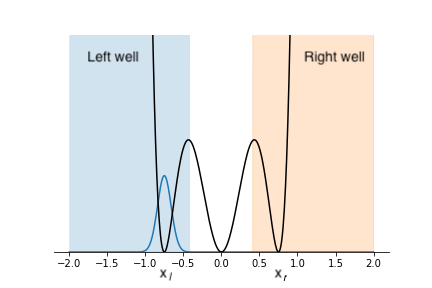

# gym-stirap

A Pyhton 2/3 class for controlling a STIRAP (although not so adiabatic...) process in a 1D potential.

The potential is made of three harmonic wells

```math
    v(x) = \frac 12  k  (x-x_l)^2 x^2 (x-x_r)^2
```




where $`x_l`$ and $`x_r`$ are the centers of the left and right well, respectively.
The central well is centered in zero.

The quantum system is originally in the ground state of the left well. The player
can move the position of the two wells $`x_l`$ and $`x_r`$ in time.

The goal is to **transfer the population to the right side**.


## Usage

Clone the repository and configure a Python 2/3 environment (with `conda` or `venv`), then run
```
pip install ./
```

or

```
python setup.py install
```

## Example

To run an instance of the environment you can follow this basic example:

```python
import gym_stirap
import numpy as np

# Create the environment
env = gym_stirap.StirapEnv()

env.reset() # Reinitialize the environment

reward = np.zeros(env.timesteps) # Keeps track of the rewards

for t in range(env.timesteps):
    env.render() # Shows a figure with the time evolution

    # Performs a random action
    action = 2*np.random.rand(2)-1

    # Perform a step of the evolution (with the chosen action)
    # Returns the new state, a reward, a bool that tells if the
    # dynamics is complete
    observation, reward[t], done, {} = env.step(action)

    if done:
        print("Episode finished after {} timesteps".format(t+1))
        break

print("Score: ", np.sum(reward)) # Print the total reward accumulated
```